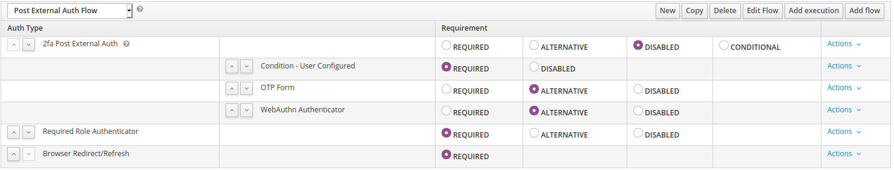
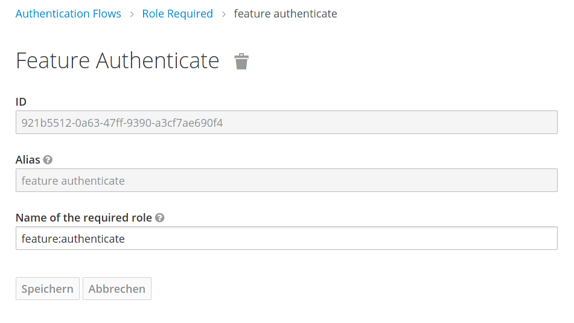

# Keycloak role authenticator

This simple module allows authenticating for a Keycloak role before handing over the authentication flow back to a client. For example, you can allow access to an application only for a single role. 
It is inspired by [`auth-require-role-authenticator`](https://github.com/thomasdarimont/keycloak-extension-playground/tree/master/auth-require-role-extension).

In contrast to the built-in `User Role Authenticator` this authenticator does not require you to create an own flow for every client which might have a different user set. This module allows you to add one role per client and assign users to those specific roles while having only central authentication flows. Additionally, with this module you can set a specific error message per client to let your users know why they are not able to login.

## Installation

### Dependencies

To install this module, you need to place the [generated jar-file](https://rechenknecht.net/giz/keycloak/role-authenticator/-/jobs/artifacts/master/download?job=build-jar) to Keycloak deployments. For the official Docker containers, the Keycloak deployments are located in `/opt/keycloak/providers`.

### Keycloak flows

In order to use the module during authentication, you need to include it in the authentication flows in Keycloak.

#### Default authentication flow

⚠ Please take care **using** all the flows you will set up in this section, e.g. by using the global flow bindings of your realm and checking for every client that there is not another flow defined there.

You need to add a default browser authentication flow like this:

For the direct grant flow, you need something like:

If you are using external identity providers, it is very important to check the role after the provider authenticated the user. Therefore, you have to overwrite the `Post Login Flow` in your identity providers with a flow like this:

⚠ If you use any other flows, make sure you don't need to include the `Required Role Authenticator` there as well.

## Usage

Before you can use the authenticator, you need to configure it. On the Keycloak authentication flow page, click on `Actions` and `Configure`. By default, the required role is `feature:authenticate`.

Then if this role exists on a client, this module will take action. If the role does not exist, the module will just succeed.

For all users, which should get access to such client, you need to assign them the role.

You can set a unique access denied message to the role `feature:authenticate` by adding an attribute `deniedMessage` to it, which will be shown when a user is missing this specific role to use the client. The following screen is presented to the user:

